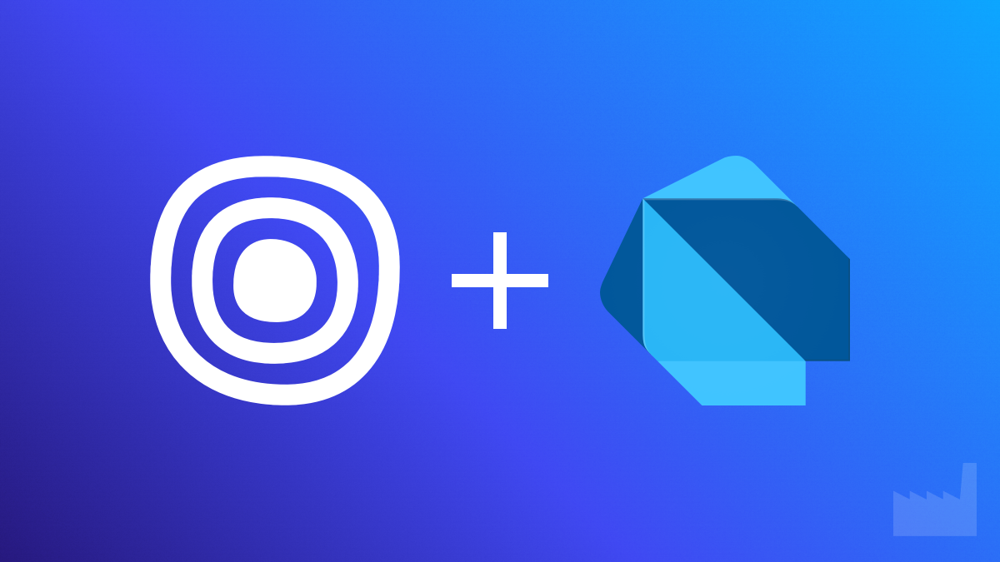

# Outseta Dart API Client

[](https://github.com/dartfoundry/outseta)

A comprehensive Dart API client for the [Outseta.com](https://www.outseta.com?via=dartfoundry) REST API V1. This library provides a type-safe interface to interact with all Outseta API endpoints including CRM, Billing, Marketing, and Support functions.

[](https://pub.dev/packages/outseta)
[](https://opensource.org/licenses/MIT)

## Features

- **Authentication**: Support for both API key auth (server-side) and bearer token auth (client-side)
- **CRM**: Manage people, accounts, and deals
- **Billing**: Handle subscriptions, invoices, plans, and payments
- **Marketing**: Work with email campaigns, lists, and subscribers
- **Support**: Create and manage support tickets
- **User Profile**: Manage user profiles and authentication
- **Type-safe**: All models are fully typed with JSON serialization support
- **Pagination**: Built-in support for paginated responses

[](https://outseta.com?via=dartfoundry)

## API Overview

You can read the accompanying article at [DartFoundry.com](https://dartfoundry.com/introducing-the-outseta-dart-api-client-powering-membership-businesses-with-dart).

| Module | Functionality | Key Methods | Models |
|--------|--------------|-------------|--------|
| **CRM** | Customer relationship management | `getPeople()`, `createAccount()`, `getDeal()` | `Person`, `Account`, `Deal` |
| **Billing** | Subscription and payment management | `getPlans()`, `createSubscription()`, `getInvoice()` | `Plan`, `Subscription`, `Invoice`, `Payment` |
| **Marketing** | Email campaigns and lists | `getLists()`, `createEmail()`, `addSubscriber()` | `EmailList`, `Email` |
| **Support** | Help desk and tickets | `getTickets()`, `addComment()`, `changeStatus()` | `Ticket` |
| **User Profile** | User authentication and profile | `getCurrentUser()`, `updateProfilePicture()`, `changePassword()` | `User` |

## Getting Started

Add the package to your `pubspec.yaml`:

```yaml
dependencies:
  outseta: ^1.0.0
```

Then run:

```bash
dart pub get
```

## Usage

### Initializing the client

```dart
import 'package:outseta/outseta.dart';

// For server-side usage with API keys
final client = OutsetaClient(
  baseUrl: 'https://your-domain.outseta.com/api/v1',
  auth: ApiKeyAuth(
    apiKey: 'your-api-key',
    secretKey: 'your-secret-key',
  ),
);

// For client-side usage with bearer token
final client = OutsetaClient(
  baseUrl: 'https://your-domain.outseta.com/api/v1',
  auth: BearerTokenAuth(
    accessToken: 'user-access-token',
  ),
);
```

### Working with the CRM

```dart
// Get people
final peopleResponse = await client.crm.getPeople(limit: 10);
for (final person in peopleResponse.items) {
  print('${person.fullName} (${person.email})');
}

// Get a specific account
final account = await client.crm.getAccount('account-uid');
print(account.name);

// Create a new person
final newPerson = Person(
  firstName: 'John',
  lastName: 'Doe',
  email: 'john.doe@example.com',
);
final createdPerson = await client.crm.createPerson(newPerson);
```

### Working with Billing

```dart
// Get available plans
final plansResponse = await client.billing.getPlans();
for (final plan in plansResponse.items) {
  print('${plan.name}: \$${plan.amount} per ${plan.billingTerm?.toLowerCase()}');
}

// Get a specific subscription
final subscription = await client.billing.getSubscription('subscription-uid');
print('Subscription status: ${subscription.status}');
```

### Working with Marketing

```dart
// Get email lists
final listsResponse = await client.marketing.getLists(limit: 20);
for (final list in listsResponse.items) {
  print('${list.name}: ${list.subscriberCount} subscribers');
}

// Create a new email list
final newList = EmailList(
  name: 'Newsletter Subscribers',
  description: 'People who want to receive our monthly newsletter',
);
final createdList = await client.marketing.createList(newList);

// Add a subscriber to the list
await client.marketing.addSubscriber(
  createdList.uid!,
  'person-uid-here',
);

// Create and schedule an email campaign
final emailCampaign = Email(
  subject: 'Monthly Newsletter - January',
  fromName: 'Your Company',
  fromEmail: 'newsletter@example.com',
  content: '<h1>January Newsletter</h1><p>Here are our updates...</p>',
  emailListUid: createdList.uid,
);
final createdEmail = await client.marketing.createEmail(emailCampaign);

// Schedule the email to be sent
final tomorrow = DateTime.now().add(Duration(days: 1));
await client.marketing.scheduleEmail(createdEmail.uid!, tomorrow);
```

### Managing Support Tickets

```dart
// Create a support ticket
final ticket = Ticket(
  subject: 'Help needed',
  description: 'I need help with my account',
  priority: 'Medium',
);
final createdTicket = await client.support.createTicket(ticket);

// Add a comment to a ticket
await client.support.addComment(
  createdTicket.uid!,
  'This is a comment',
  isPrivate: true,
);

// Change the status of a ticket
await client.support.changeStatus(createdTicket.uid!, 'In Progress');

// Assign a ticket to a support agent
await client.support.assignTicket(createdTicket.uid!, 'support-agent-uid');

// Get tickets assigned to a specific person
final assignedTickets = await client.support.getTicketsAssignedToPerson(
  'support-agent-uid',
  limit: 10,
);
print('Found ${assignedTickets.metadata.total} assigned tickets');
```

### Working with User Profiles

```dart
// Get the current user's profile
final currentUser = await client.userProfile.getCurrentUser();
print('Logged in as: ${currentUser.email}');

// Update a user's profile
final updatedUser = currentUser.copyWith(
  firstName: 'New First Name',
);
await client.userProfile.updateCurrentUser(updatedUser);

// Change a user's password
await client.userProfile.changePassword(
  'current-password',
  'new-password',
  'new-password',
);

// Request a password reset for a user
await client.userProfile.requestPasswordReset('user@example.com');

// Get an access token for client-side authentication
final token = await client.userProfile.getAccessToken(
  'username@example.com',
  'password',
);
print('Access token: $token');

// Update a profile picture (base64 encoded image)
final base64Image = 'data:image/png;base64,iVBORw0KGgoAAAANSUhE...';
await client.userProfile.updateProfilePicture(base64Image);
```

## Additional Information

### Authentication

Outseta supports two authentication methods:

1. **API Key Authentication**: For server-side applications. Create API keys in your Outseta account under Settings > Integrations > API Keys.

2. **Bearer Token Authentication**: For client-side applications. Get a token by using the `getAuthToken` function or through the UserProfileApi.

### Pagination

All list endpoints return paginated responses with metadata:

```dart
final response = await client.crm.getPeople(offset: 0, limit: 10);
print('Total people: ${response.metadata.total}');
print('Current page size: ${response.metadata.count}');
print('Offset: ${response.metadata.offset}');
```

### Error Handling

The client provides typed exceptions for different error scenarios:

```dart
try {
  await client.crm.getPerson('invalid-uid');
} on NotFoundException catch (e) {
  print('Person not found: ${e.message}');
} on UnauthorizedException catch (e) {
  print('Authentication error: ${e.message}');
} on ApiException catch (e) {
  print('API error: ${e.message}');
}
```

## API Reference

### Billing API

| Method | Description | Parameters |
|--------|-------------|------------|
| `getPlans()` | Get a paginated list of plans | `offset`, `limit`, `filter` |
| `getPlan()` | Get a plan by UID | `uid` |
| `createPlan()` | Create a new plan | `plan` |
| `updatePlan()` | Update an existing plan | `plan` |
| `deletePlan()` | Delete a plan | `uid` |
| `getSubscriptions()` | Get a paginated list of subscriptions | `offset`, `limit`, `filter` |
| `getSubscription()` | Get a subscription by UID | `uid` |
| `createSubscription()` | Create a new subscription | `subscription` |
| `updateSubscription()` | Update an existing subscription | `subscription` |
| `cancelSubscription()` | Cancel a subscription | `uid`, `cancellationReason` |
| `getInvoices()` | Get a paginated list of invoices | `offset`, `limit`, `filter` |
| `getInvoice()` | Get an invoice by UID | `uid` |
| `createInvoice()` | Create a new invoice | `invoice` |
| `updateInvoice()` | Update an existing invoice | `invoice` |
| `markInvoiceAsPaid()` | Mark an invoice as paid | `uid` |
| `getPayments()` | Get a paginated list of payments | `offset`, `limit`, `filter` |
| `getPayment()` | Get a payment by UID | `uid` |
| `createPayment()` | Create a new payment | `payment` |
| `refundPayment()` | Refund a payment | `uid`, `amount` |

### CRM API

| Method | Description | Parameters |
|--------|-------------|------------|
| `getPeople()` | Get a paginated list of people | `offset`, `limit`, `filter` |
| `getPerson()` | Get a person by UID | `uid` |
| `createPerson()` | Create a new person | `person` |
| `updatePerson()` | Update an existing person | `person` |
| `deletePerson()` | Delete a person | `uid` |
| `getAccounts()` | Get a paginated list of accounts | `offset`, `limit`, `filter` |
| `getAccount()` | Get an account by UID | `uid` |
| `createAccount()` | Create a new account | `account` |
| `updateAccount()` | Update an existing account | `account` |
| `deleteAccount()` | Delete an account | `uid` |
| `addPersonToAccount()` | Add a person to an account | `accountUid`, `personUid` |
| `removePersonFromAccount()` | Remove a person from an account | `accountUid`, `personUid` |
| `getDeals()` | Get a paginated list of deals | `offset`, `limit`, `filter` |
| `getDeal()` | Get a deal by UID | `uid` |
| `createDeal()` | Create a new deal | `deal` |
| `updateDeal()` | Update an existing deal | `deal` |
| `deleteDeal()` | Delete a deal | `uid` |

### Marketing API

| Method | Description | Parameters |
|--------|-------------|------------|
| `getLists()` | Get a paginated list of email lists | `offset`, `limit`, `filter` |
| `getList()` | Get an email list by UID | `uid` |
| `createList()` | Create a new email list | `list` |
| `updateList()` | Update an existing email list | `list` |
| `deleteList()` | Delete an email list | `uid` |
| `getSubscribers()` | Get subscribers for a list | `listUid`, `offset`, `limit`, `filter` |
| `addSubscriber()` | Add a subscriber to a list | `listUid`, `personUid` |
| `removeSubscriber()` | Remove a subscriber from a list | `listUid`, `personUid` |
| `getEmails()` | Get a paginated list of email campaigns | `offset`, `limit`, `filter` |
| `getEmail()` | Get an email campaign by UID | `uid` |
| `createEmail()` | Create a new email campaign | `email` |
| `updateEmail()` | Update an existing email campaign | `email` |
| `deleteEmail()` | Delete an email campaign | `uid` |
| `sendTestEmail()` | Send a test email | `emailUid`, `recipientEmail` |
| `scheduleEmail()` | Schedule an email campaign | `emailUid`, `scheduledDate` |
| `sendEmailNow()` | Send an email campaign immediately | `emailUid` |
| `cancelScheduledEmail()` | Cancel a scheduled email campaign | `emailUid` |

### Support API

| Method | Description | Parameters |
|--------|-------------|------------|
| `getTickets()` | Get a paginated list of tickets | `offset`, `limit`, `filter` |
| `getTicket()` | Get a ticket by UID | `uid` |
| `createTicket()` | Create a new ticket | `ticket` |
| `updateTicket()` | Update an existing ticket | `ticket` |
| `deleteTicket()` | Delete a ticket | `uid` |
| `addComment()` | Add a comment to a ticket | `ticketUid`, `comment`, `isPrivate` |
| `changeStatus()` | Change the status of a ticket | `ticketUid`, `status` |
| `assignTicket()` | Assign a ticket to a person | `ticketUid`, `personUid` |
| `getTicketsAssignedToPerson()` | Get tickets assigned to a person | `personUid`, `offset`, `limit` |
| `getTicketsSubmittedByPerson()` | Get tickets submitted by a person | `personUid`, `offset`, `limit` |

### User Profile API

| Method | Description | Parameters |
|--------|-------------|------------|
| `getCurrentUser()` | Get the current user's profile | none |
| `updateCurrentUser()` | Update the current user's profile | `user` |
| `changePassword()` | Change the current user's password | `currentPassword`, `newPassword`, `confirmPassword` |
| `requestPasswordReset()` | Request a password reset for a user | `email` |
| `resetPassword()` | Reset a user's password using a token | `token`, `newPassword`, `confirmPassword` |
| `getAccessToken()` | Get an access token for client-side auth | `username`, `password` |
| `verifyEmail()` | Verify an email address | `token` |
| `requestEmailVerification()` | Request a new email verification token | `email` |
| `updateProfilePicture()` | Update the user's profile picture | `base64Image` |

## Testing

The package includes comprehensive tests for all API modules:

```bash
# Run all tests
dart run test

# Run tests with coverage
dart run test --coverage=coverage
```

### Integration Tests

Some functionality, like the `getAuthToken()` function, requires actual API credentials and network connections. These tests are separate from the main test suite:

```bash
# Create a .env file with your Outseta credentials
# OUTSETA_BASE_URL=https://your-domain.outseta.com/api/v1
# OUTSETA_USERNAME=your-username
# OUTSETA_PASSWORD=your-password

# Run integration tests
dart test --tags=integration integration_test/
```

### Test Coverage

The package includes comprehensive tests with high code coverage for all components:

- **Authentication**: API Key and Bearer Token authentication methods
- **Exception Handling**: All exception types and error scenarios
- **OutsetaClient**: HTTP methods (GET, POST, PUT, DELETE) and error handling
- **CRM API**: People, accounts, and deals operations
- **Billing API**: Plans, subscriptions, invoices, and payments management
- **Marketing API**: Lists, subscribers, and email campaigns
- **Support API**: Tickets, comments, and ticket management
- **User Profile API**: User profile management and authentication
- **Models**: Serialization/deserialization, equality comparison, and copying

> **Note**: Some functions, like `getAuthToken()`, are excluded from coverage metrics as they require actual API connections. See `test/coverage_exclusions/README.md` for details on these exclusions.

Each API module has tests for:
- Retrieving paginated collections
- Getting individual resources
- Creating and updating resources
- Special operations specific to that module
- Error handling and validation

### Viewing Test Coverage

To view the coverage report:

```bash
# Install coverage tools if you haven't already
dart pub global activate coverage

# Installing lcov (required for HTML reports)
# On macOS
brew install lcov

# On Ubuntu/Debian
sudo apt-get install lcov

# On Windows (using Chocolatey)
choco install lcov

# Run tests with coverage
dart run test --coverage=coverage

# Process the coverage report (excluding generated files)
dart pub global run coverage:format_coverage --lcov --in=coverage --out=coverage/lcov.info --report-on=lib/ --exclude-files="lib/src/generated/**,**/*.g.dart"

# Generate HTML report (requires lcov)
genhtml -o coverage/html coverage/lcov.info

# Open the HTML report
open coverage/html/index.html  # On macOS
xdg-open coverage/html/index.html  # On Linux
start coverage/html/index.html  # On Windows
```

The `dart_test.yaml` file in the project root includes coverage configurations that exclude functions that can't be properly unit tested, such as those requiring actual network connections.

For VS Code users, you can also use the "Dart Code Coverage" extension to visualize coverage directly in your editor.

## Contributing

Contributions are welcome! Please feel free to submit a Pull Request.

## Copyright

Copyright (c) 2025 Dom Jocubeit

## License

This project is licensed under the MIT License - see the LICENSE file for details.
